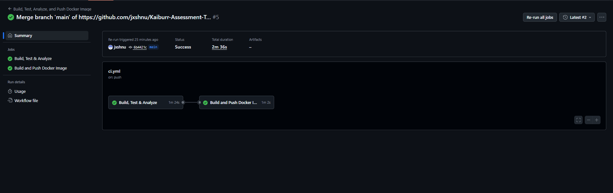
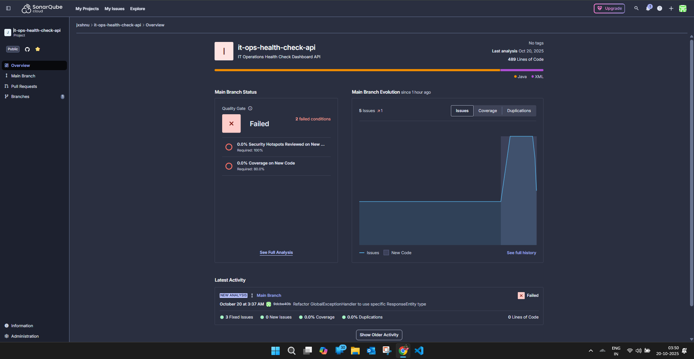
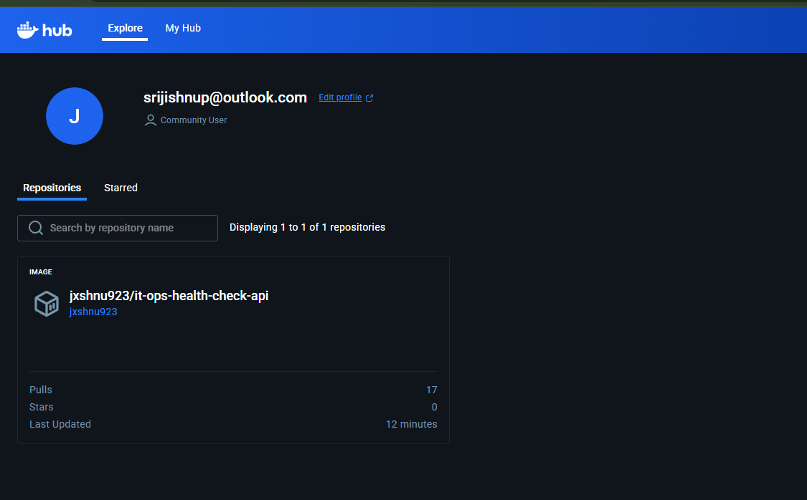

 Kaiburr Assessment - Task 4: CI/CD Pipeline with GitHub Actions

This repository contains **Task 4** of the Kaiburr technical assessment — implementing a **CI/CD pipeline** for the Java backend application using **GitHub Actions**.

The pipeline automatically **builds**, **tests**, **analyzes**, **containerizes**, and **publishes** the application as a Docker image, ensuring every code change results in a production-ready artifact.

 Pipeline Overview

The CI/CD pipeline is defined in `.github/workflows/ci.yml` and runs automatically on every push to the `main` branch.

 **Job 1: Build, Test & Analyze**
- **Checkout & Setup:** Checks out the repository and sets up JDK 21.
- **Build & Test:** Executes `mvn clean verify` to compile and test the project.
- **Code Quality:** Performs static analysis using **SonarCloud**, identifying bugs, vulnerabilities, and code smells.

 **Job 2: Docker Build & Push**
- **Login:** Authenticates with Docker Hub using GitHub Secrets.
- **Build:** Builds a production-ready Docker image using the project’s `Dockerfile`.
- **Tag & Push:** Pushes two tags to Docker Hub:
  - `latest` — the most recent successful build
  - `1.${{ github.run_number }}` — versioned build number

  Required Secrets

| Secret Name | Description |
|--|-|
| `DOCKERHUB_USERNAME` | Your Docker Hub username |
| `DOCKERHUB_TOKEN` | Docker Hub Access Token (Read/Write/Delete) |
| `SONAR_TOKEN` | Token from your SonarCloud account |
| `SONAR_PROJECT_KEY` | Project key for SonarCloud |
| `SONAR_HOST_URL` | Should be `https://sonarcloud.io` |

 SonarCloud Setup
1. Go to [SonarCloud.io](https://sonarcloud.io/).
2. Click **+ → Analyze a new project**.
3. Select this GitHub repository.
4. Follow setup instructions to obtain `SONAR_PROJECT_KEY` and `SONAR_TOKEN`.

 Docker Hub Setup
1. Log in to [hub.docker.com](https://hub.docker.com/).
2. Go to **Account Settings → Security → New Access Token**.
3. Create a token with `Read/Write/Delete` access.
4. Add it to GitHub Secrets as `DOCKERHUB_TOKEN`.

 How to Run the Pipeline

1. **Push your code** to the `main` branch.
2. The workflow triggers automatically under **Actions**.
3. The pipeline will:
   - Build and test your Java project.
   - Run SonarCloud analysis.
   - Build and push a Docker image to Docker Hub.

Proof of Execution

 **1. Successful GitHub Actions Run**

2. SonarCloud Dashboard

here the test failed as i didnt include testing to cover the code. also the security failed bc i inluded New code
@CrossOrigin(origins = "*") in HealthCheckController.java to connect to UI. or else it would have passed

3. Docker Hub Repository

   Notes
- This repository contains a **copy** of the Java app (from Task 1), as required by the Kaiburr assessment.
- In real-world setups, this workflow would be integrated directly into the main repository.

